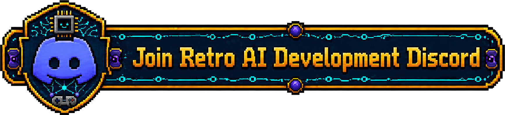

# DuckHuntNESRecomp

> _This recompilation is a **byproduct of developing
> [nesrecomp](https://github.com/mstan/nesrecomp)** — the games are the proving ground, the framework is the goal.
> **These are in-development previews, not finished ports — expect rough
> edges**, and depth will keep landing over months, not days. My time for any
> one title is limited, so I ask for your patience. Contributions are welcome —
> testing, issues, and PRs to the game or framework all help and will
> accelerate this game's polish. More on the why at:
> [Recomp + AI: 5 Months Later »](https://1379.tech/recomp-ai-5-months-later/)_

Static recompilation of Duck Hunt (NES) for native PC.
Built with the [NESRecomp](https://github.com/mstan/nesrecomp) framework.

> **Status: Playable.** Title screen, game mode selection, and gameplay (shooting ducks with the Zapper) all work. If you find a bug, please open an issue.

## What Works

- Title screen with game mode selection (Game A / B / C)
- Zapper light gun via mouse — point and click to shoot
- Duck flight, hit detection, and scoring
- Dog animations (laughing, retrieving)
- Round progression

## Special Feature: Mouse-as-Zapper

Duck Hunt requires the NES Zapper light gun. This recompilation maps your **mouse** to the Zapper:

- **Move mouse** — aim the Zapper
- **Left click** — pull the trigger
- A **crosshair** is drawn at the aim point (white normally, red when firing)
- The OS cursor is hidden while in the game window

The Zapper light detection is fully simulated — the game's two-phase detection sequence (anti-cheat black screen check, then detection flash) works correctly, just like on real hardware.

## Quick Start

1. Download `DuckHuntNESRecomp-windows-x64.zip` from [Releases](../../releases)
2. Extract and run `DuckHuntRecomp.exe`
3. Place your `Duck Hunt (World).nes` ROM in the same directory, or select it at runtime

## Controls

| NES Button | Keyboard       |
|------------|----------------|
| D-Pad      | Arrow keys     |
| A          | Z              |
| B          | X              |
| Start      | Enter          |
| Select     | Tab            |

| Action          | Input             |
|-----------------|-------------------|
| Aim Zapper      | Mouse movement    |
| Fire Zapper     | Left mouse button |

**Title screen navigation:** Press **Tab** (Select) to cycle game modes, **Enter** (Start) to confirm.

## Building from Source

Requires Visual Studio 2022 and CMake 3.20+.

```bash
git clone https://github.com/mstan/DuckHuntNESRecomp
cd DuckHuntNESRecomp

# Windows
setup.bat

# Linux / macOS
chmod +x setup.sh && ./setup.sh
```

This initializes the pinned [nesrecomp](https://github.com/mstan/nesrecomp)
submodule and links the Nestopia oracle core.

Then build:

```bash
cmake -S . -B build -G "Visual Studio 17 2022" -A x64
cmake --build build --config Release
```

Place your `Duck Hunt (World).nes` ROM in the build directory or select it at runtime.

## Architecture

This is a **static recompiler**, not an emulator. The original 6502 machine code is translated to C at build time, then compiled to native x64. The NES PPU, APU, and mapper are simulated by the runner library.

- `game.toml` — recompiler configuration
- `extras.c` — game-specific hooks (Zapper init, debug server)
- `generated/` — auto-generated C code (do not edit manually)
- `nesrecomp/` — framework submodule (recompiler + runner)

## Known Limitations

- Audio is basic (APU register writes are captured but full mixing is work-in-progress)

---

<p align="center">
  <sub><b>R.A.I.D. — Retro AI Development</b> · a Discord for AI-assisted retro reverse-engineering, decomp &amp; recomp</sub>
</p>

<p align="center">
  <a href="https://discord.gg/Ad9BwSzctP"></a>
</p>
